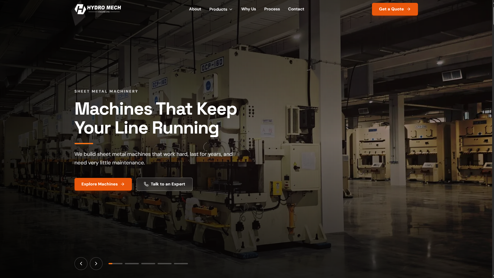
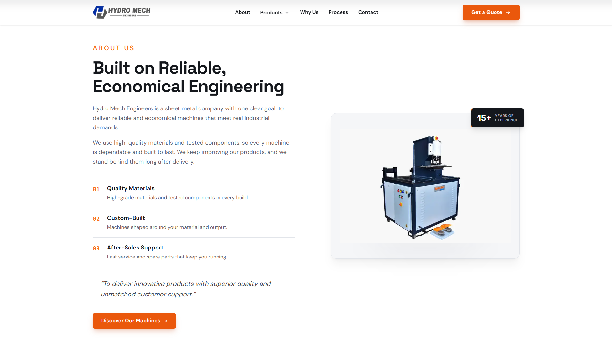
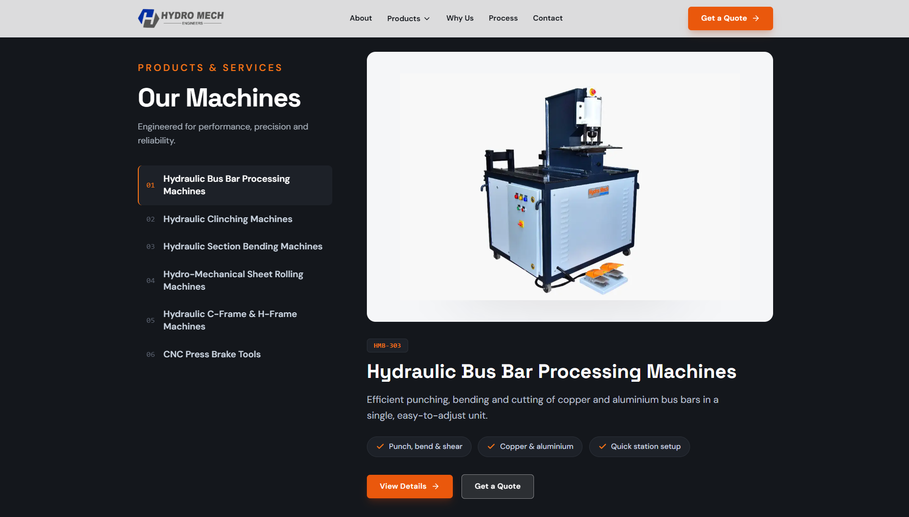
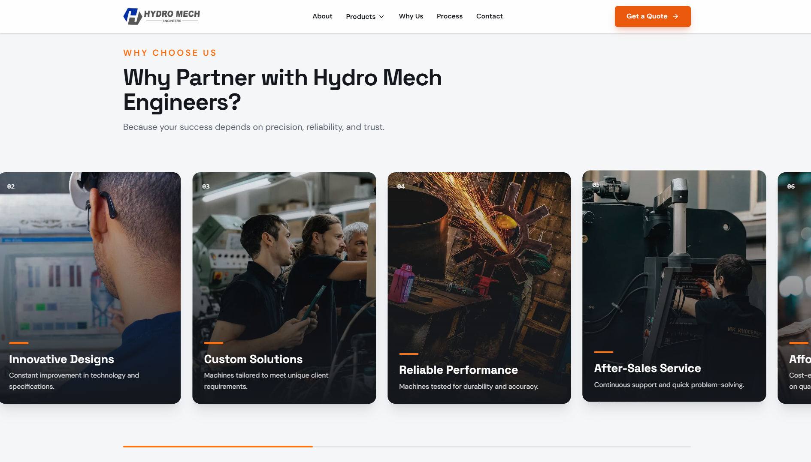
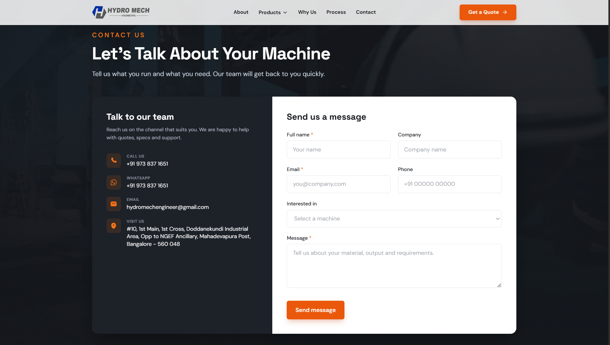

# Ethics Metal Forming Machineries Website

A fast, responsive marketing website for Ethics Metal Forming Machineries, a sheet metal machine manufacturer based in Bangalore. It presents the company, its six machine categories, and a way to get in touch.

This project was built as an internship screening task. The goal was a premium, responsive website that uses the company's real brochure content and does not look AI generated.

**Live demo:** <https://hydromech-engineers-homepage.vercel.app>



## About the project

The site is a single page homepage plus a detail page for each machine. Content comes from the company brochure, so the copy and specifications are real. The design uses one accent colour, large clear type, real photography, and restrained motion, so it reads as a professional industrial brand rather than a generic template.

## Screenshots

**About Us**



**Products and Services**



**Why Choose Us**



**Contact**



## Tech stack

- **Next.js 16** (App Router) with **React 19**
- **TypeScript 5**
- **Tailwind CSS v4** (CSS-first setup, tokens defined in `app/globals.css`)
- **Framer Motion** for scroll and entrance animations
- **Iconify** and **lucide-react** for icons
- **next/font** for the type pairing (Space Grotesk for headings, DM Sans for body)
- **next/image** for optimised images
- **clsx** and **tailwind-merge** for class handling

## Features

- Full screen hero with a five slide image carousel, rotating headlines, autoplay that pauses on hover, and touch swipe
- Animated stats bar
- About section with the company story and real machine photo
- Products section with a sticky index on the left and machine panels that highlight as you scroll
- Why Choose Us section built as a pinned horizontal scroll of image cards on desktop, and a swipe carousel on mobile
- Process timeline
- Contact section with a banner image, real contact details, and a form with client side validation
- Footer with quick links, machine links, and contact channels
- Six product detail pages at `/products/[slug]` with overview, full specifications, key features, and a photo gallery where photos exist
- Fully responsive across phone, tablet, and desktop
- Smooth animations that respect the `prefers-reduced-motion` setting
- Accessible markup with keyboard support, visible focus states, and image alt text

## Project structure

```
app/
  layout.tsx              Root layout, fonts, metadata
  page.tsx                Homepage
  globals.css             Tailwind v4 setup and brand tokens
  products/[slug]/page.tsx  Product detail pages (6 routes)
components/
  Header.tsx, Hero.tsx, TrustBar.tsx, About.tsx, Products.tsx,
  WhyChooseUs.tsx, Process.tsx, Contact.tsx, Footer.tsx
  ui/                     Reusable pieces (Container, Button, Logo, Reveal, etc.)
lib/
  content.ts              All site content and data in one place
public/                   Images (logo, hero, products, why, contact banner)
```

## Getting started

### Prerequisites

- Node.js 20 or newer
- npm

### Install and run

```bash
# install dependencies
npm install

# start the development server
npm run dev
```

Open http://localhost:3000 in your browser.

### Other scripts

```bash
# create a production build
npm run build

# run the production build locally
npm start

# check linting
npm run lint
```

## Editing content

All copy and data live in one file: `lib/content.ts`. This includes the site details, navigation links, hero slides, the six products with their specifications and features, the Why Choose Us reasons, the process steps, and the stats. To change wording or specs, edit this file. The components read from it, so the pages update automatically.

## Design and content notes

- **Brand name:** the supplied logo file is named "ETHICS", but the brochure, the website, and the labels on the machines all read "Ethics Metal Forming Machineries". The site is branded as Ethics Metal Forming Machineries, and the real logo asset is used in the header and footer.
- **Colours:** a graphite dark tone with an orange accent, taken from the foot pedals on the real machines. There is no blue in the interface.
- **Type:** Space Grotesk for headings and DM Sans for body text.
- **Honest copy:** all claims are grounded in the brochure. There are no invented certifications, awards, or numbers.

## Images and credits

- **Product photos:** the company's own machine photos from the brochure.
- **Atmospheric and section photos:** free licensed stock from [Pexels](https://www.pexels.com). These are real photographs, not AI generated.

Pexels photo IDs by section:

- Hero: 31352672, 17180807, 8865187, 2760241, 29988955
- Why Choose Us: 15056622, 37769419, 34054482, 27102111, 35072827, 19544217
- Contact banner: 6804255

The images were sourced from Pexels and the company brochure. They were not generated by AI.

## Deployment

The site is deployed on [Vercel](https://vercel.com). It needs no special configuration:

- Framework preset: Next.js (detected automatically)
- Root directory: `./`
- Environment variables: none

Push to the connected GitHub repository, or use Vercel's import flow, and deploy.

## Notes and limitations

- The contact form is client side only. It validates the input and shows a success message, but it does not send the data to a server.
- The "Request a Quote" buttons link to the contact section.

